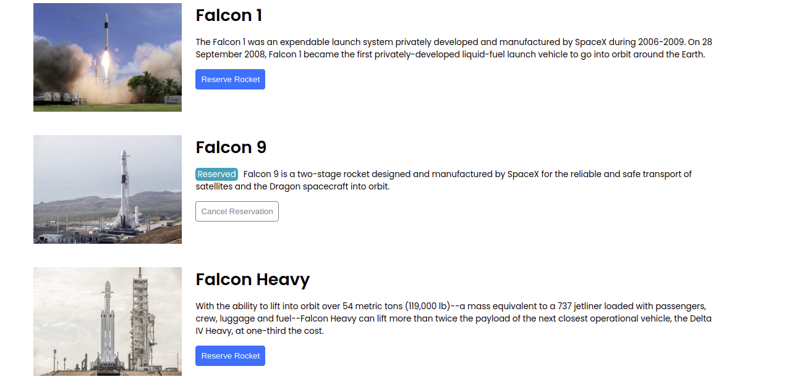
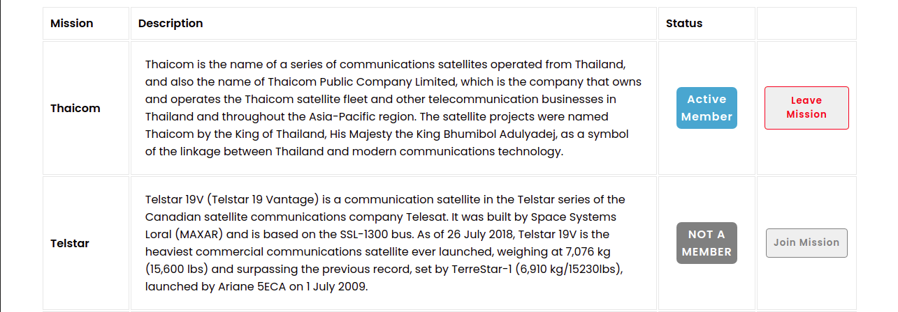
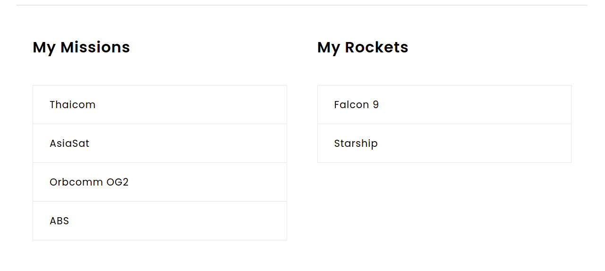

# SpaceX Travellers' Hub
The Space Travelers' Hub consists of Rockets, Missions, and the My Profile section. The Rockets section displays a list of all available SpaceX rockets. Users can book each rocket by clicking the reservation button or cancel the previously made booking. The Missions section displays a list of current missions along with their brief description and participation status. The My Profile section displays all reserved rockets and space missions.

### Navbar

### Rockets

### Missions

### Profile


This project is part of the Microverse curriculum module 3. The main objective is to understand how create a React app, use components, hooks, state, redux, run tests, and creating professional documentation for development.

## Live Preview
[SpaceX Travellers' Hub](https://spacexhub.netlify.app/)

## Built With

- React
- JavaScript
- CSS

## Additional Tools

- Stylelint
- Eslint
- babel
- Jest

## `Getting Started`

To get a local copy of this project:

Clone this repository or download the Zip folder:
```
git clone git@github.com:KDlamini/space-travellers-hub.git
```

To get started, In the project directory, you can run:
```
npm install
```
run react app and open in browser:
```
npm start
```
Runs the app in the development mode.\
Open [http://localhost:3000](http://localhost:3000) to view it in the browser.

If you encounter an issue related to eslint or webpack version conflict run:
```
npm audit fix --force
```

## `Tests`
To check development tests run:
```
ynpm run test
```
Launches the test runner in the interactive watch mode.


### To track linter errors locally follow these steps:  

Track CSS linter errors run:
```
npx stylelint "**/*.{css,scss}"
```
Track JavaScript linter errors run:
```
npx eslint .
```

## `Deployement`
```
npm build
```
Builds the app for production to the `build` folder.\
It correctly bundles React in production mode and optimizes the build for the best performance.

The build is minified and the filenames include the hashes.\
Your app is ready to be deployed!

### `npm eject`

**Note: this is a one-way operation. Once you `eject`, you can’t go back!**

If you aren’t satisfied with the build tool and configuration choices, you can `eject` at any time. This command will remove the single build dependency from your project.

Instead, it will copy all the configuration files and the transitive dependencies (webpack, Babel, ESLint, etc) right into your project so you have full control over them. All of the commands except `eject` will still work, but they will point to the copied scripts so you can tweak them. At this point you’re on your own.

You don’t have to ever use `eject`. The curated feature set is suitable for small and middle deployments, and you shouldn’t feel obligated to use this feature. However we understand that this tool wouldn’t be useful if you couldn’t customize it when you are ready for it.

## Authors

👤 **Leandro Barreto**
- GitHub: [@Leandro-Barretoo](https://github.com/Leandro-Barretoo)
- LinkedIn: [LinkedIn](https://www.linkedin.com/in/leandroobarreto/)

👤 **Simo Nkosi**

- GitHub: [@KDlamini](https://github.com/KDlamini)
- Twitter: [@RealSimoNkosi](https://twitter.com/RealSimoNkosi)
- LinkedIn: [LinkedIn](https://www.linkedin.com/in/simo-nkosi-418523180/)


## 🤝 Contributing

Contributions, issues, and feature requests are welcome!  
Feel free to check the [issues page](https://github.com/KDlamini/space-travellers-hub/issues).


## Show your support

Give a ⭐️ if you like this project!

## Acknowledgments

- This project is part module 3 in the Microverse study program.
- Thanks to the Microverse team for the great curriculum.
- Thanks to Code Reviewers for the insightful feedback.
- A great thanks to My coding partners, morning session team, and standup team Partners for their contributions.

## 📝 License

This project is [MIT](./MIT.md) licensed.